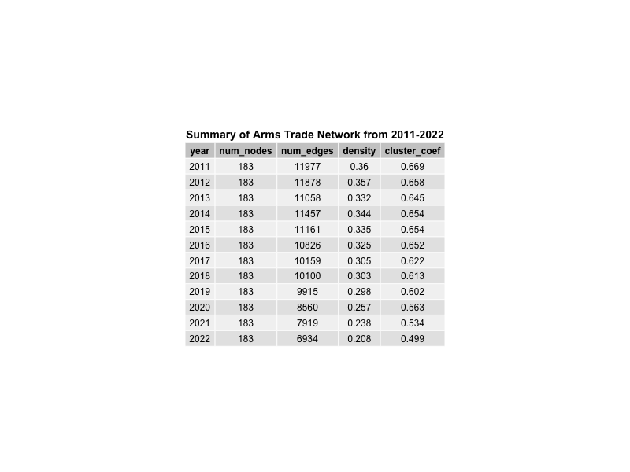
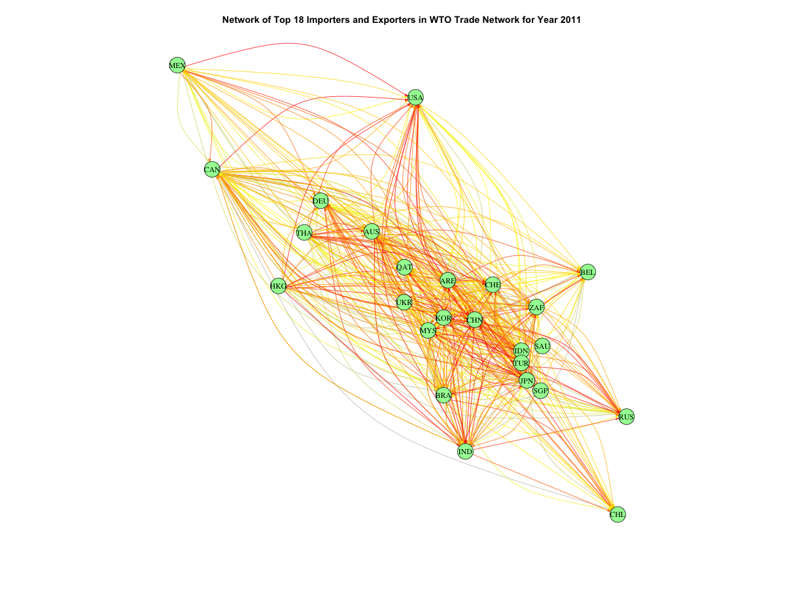
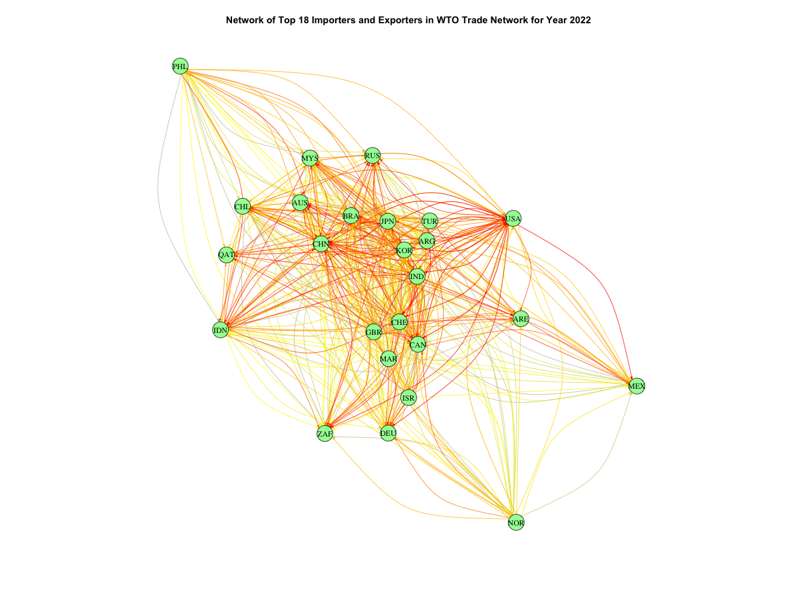

```{r setup, include=FALSE}
knitr::opts_chunk$set(echo = TRUE)
```

# Introduction

The global arms trade is a controversial topic that is extremely relevant to the fields of policy, politics, and economics. However, there has been a lack of empirical research on the political economics of arms trade [@akerman]. To address this gap, Akerman and Seim conducted a study that characterized bilateral arms trade as a network, which revealed differences between political pacts such as NATO and the Warsaw Pact and demonstrated how network analysis of arms trade relationships be useful in policymaking. I use network theory to similarly characterize global trade in arms and ammunition using more recent data from the years 2011 to 2022, with the aim of investigating features of the network and possible political and policy implications.

# Data Analysis
## Methodology Overview

I draw inspiration from a previous network analysis on the international coffee trade network for summary statistics of the trade dataset [@sujaritpong]. Network density, transitivity, and clustering are investigated to draw conclusions on broad patterns among the countries involved in arms trade. Any subnetworks of countries—i.e., due to geographical proximity or existing trade agreements—can be revealed by examining clustering coefficients. It is hypothesized that some countries will control a large proportion of the total imports, and a country’s strength in this network can be measured by the sum of its edge weights. I also look at other features of the network after running temporal ERGM models with various covariates.

## Data Preprocessing

A dataset of all bilateral imports from reporting countries in the World Trade Organization [@wto] is used in this analysis. Using the WTO’s publicly available statistics portal, I filtered the data by the Harmonized System product code “93 – Arms and ammunition; parts and accessories thereof” for the years 2011 to 2024. The raw dataset contains the value of imports of this product category in US dollars for each reporting entity, so entities can be represented as nodes and their bilateral trade relationship can be represented as the edge. Edges can be weighted by the dollar value of imports. This dataset can therefore be represented as a directed graph. 

"Reporting Economies" refer to the exporting entities; "Partner Economies" refer to the importing entities. We make a distinction here between "entities" and "countries" as the dataset includes aggregated reports from political entities, for example from the European Union. Therefore we filter the raw dataset to exclude all such political blocs, ending up with 200 members in the network. Data from 2023 and 2024 contained some null values so they were excluded to ensure there was complete data for each year. After constructing the `trade` graph, I have 183 nodes. An attribute `ScaledEdgeWidth` was added to represent the edge weights, which are the USD values of trades scaled to be a score between 1 and 10 for readability of network visualizations.

```{r, warning=F, message=F}
# imports
library(igraph)
library(ggplot2)
library(dplyr)
library(ggraph)
library(tidyverse)
library(tidygraph)
library(gridExtra)
library(btergm)
library(intergraph)
library(network)

load("trade.rda")
filtered_data <- read.csv("filtered_data.csv")
stats <- read.csv("stats.csv")
# str(trade)
```

## Inspecting the Data \label{stats}

#### Figure 1 \label{fig1}
 

#### Figure 2 \label{fig2}
```{r, warning=F, message=F}
# statistics of trade network across years (num edges, num nodes, density, cluster coefficient)
stats_long <- stats %>%
  pivot_longer(cols = c(density, cluster_coef), names_to = "metric", values_to = "value")
ggplot(stats_long, aes(x = year, y = value, color = metric)) +
  geom_point(size = 3) +
  geom_line() +
  scale_x_continuous(breaks = stats$year) +
  labs(title = "Density and Transitivity by Year",
       x = "Year",
       y = "Value",
       color = "Metric") +
  theme_minimal()
```

After loading the filtered dataset, I can observe that the network density, which is the proportion of connections that exist among all possible connections, is low and decreases over time. This could point to a fewer number of countries participating in arms trade in the past decade. The clustering coefficient or transitivity, which is a measure of how connected the internal communities in the network are, starts off moderately high but decreases to around 0.5 by 2022. This could indicate a decreasing tendency for countries to trade in blocs. It is also observed that the total number of edges per year has decreased by about 42% from 2011 to 2022. However, just based off of these descriptive statistics alone I cannot draw concrete conclusions about the network structure, so next I will perform some community detection to make some comparisons of the network structure between the beginning and end of the chosen time period.

## Community Detection
### Clusters for 2011 \label{fig3}

An `igraph` of the networks for 2011 and 2022 have been created and loaded in below. The clustering algorithm used is the leading eigenvector method, which calculates leading non-negative eigenvectors of the modularity matrix to find connected subgraphs and is implemented in R as `cluster_leading_eigen` [@eigen]. This algorithm was chosen because the modularity matrix is a characteristic and independent property of the network [@newman], as well as being computationally fast for a weighted graph of this size, compared to other clustering algorithms implemented in R (at least when tested on an M1 8GB MacBook Air without any other optimizations). Due to the large numbers of edges being displayed, I specify the trade value as the edge weight parameter in the `cluster_leading_eigen` function but set the edge width in the plot to be uniform for visual clarity.
```{r, warning=F, message=F}
load("yearly_trade_2011.rda")
clusters_2011 <- cluster_leading_eigen(yearly_trade_2011, weights = E(yearly_trade_2011)$Value)
V(yearly_trade_2011)$color <- membership(clusters_2011)

plot(yearly_trade_2011,
    edge.width = 1,
    edge.arrow.size = 0.2,
    edge.color = "gray",
    vertex.size = V(yearly_trade_2011)$size,
    vertex.label = NA,
    main = paste("Figure 3: Clusters in WTO Arms Trade Network for 2011")
)

```

### Clusters for 2022 \label{fig4}
```{r, warning=F, message=F}
load("yearly_trade_2022.rda")
clusters_2022 <- cluster_leading_eigen(yearly_trade_2022, weights = E(yearly_trade_2022)$Value)
V(yearly_trade_2022)$color <- membership(clusters_2022)

plot(yearly_trade_2022,
    edge.width = 1,
    edge.arrow.size = 0.2,
    edge.color = "gray",
    vertex.size = V(yearly_trade_2022)$size,
    vertex.label = NA,
    main = paste("Figure 4: Clusters in WTO Arms Trade Network for 2022")
)
```

Since it is difficult to see which countries belong to which clusters, a table of the membership of each country is provided below. I end up with 9 clusters for 2011 and 3 clusters for 2022. This decrease in the number of clusters seems consistent with the trends of decreasing number of edges, decreasing density, and decreasing transitivity observed in Figure 1 and Figure 2. In 2011, some of the clusters are roughly geographically correlated, i.e., Central/North Asian nations like Kyrgyzstan (Kyrgyz Republic), Mongolia, and Russia are in cluster 9, and most South American nations are in cluster 2. Other clusters contain a large number of countries which span various continents. In 2022, the size of each cluster is more evenly distributed, but since each cluster contains a large number of countries it is hard to discern a clear pattern based on cluster membership. 

The full lists of community detection results can be found in Appendix A (`appendixA/`).


### Comparing Clusters for 2011 and 2022
```{r, warning=F, message=F}
membership_2011 <- data.frame(
  ISO3A_Code = V(yearly_trade_2011)$name,
  Cluster = membership(clusters_2011)
)
membership_2022 <- data.frame(
    ISO3A_Code = V(yearly_trade_2022)$name,
    Cluster = membership(clusters_2022)
)

reporting_names <- filtered_data %>%
  select(ISO3A_Code = Reporting.Economy.ISO3A.Code, Country_Name = Reporting.Economy) %>% 
  distinct()

partner_names <- filtered_data %>%
  select(ISO3A_Code = Partner.Economy.ISO3A.Code, Country_Name = Partner.Economy) %>% 
  distinct()

country_names <- bind_rows(reporting_names, partner_names) %>% distinct()
membership_2011 <- left_join(membership_2011, country_names, by = "ISO3A_Code")
membership_2022 <- left_join(membership_2022, country_names, by = "ISO3A_Code")

cat("Number of clusters detected in 2011:", length(unique(membership_2011$Cluster)), "\n")
cat("Number of clusters detected in 2022:", length(unique(membership_2022$Cluster)), "\n")

# count of members per cluster and show first 5 members; see Appendix A for full lists
membership_2011 %>% group_by(Cluster) %>% summarise(n = n(), Countries = paste(head(Country_Name, 5), collapse = "; ")) 
membership_2022 %>% group_by(Cluster) %>% summarise(n = n(), Countries = paste(head(Country_Name, 5), collapse = "; "))
```


## Subgraphs of Top Importers and Exporters
Clustering patterns can show support for broad trends of the overall network, but to get a better picture of which countries influence the network the most I analyze the importance of nodes for each year. "Importance" in the network is measured as the total sum of values of imports or exports. Trade volume is used here instead of another node centrality measure as bilateral trade networks can be analyzed by strength centrality [@feng], [@sapir]. I choose the top 18 importers and the top 18 exporters for each year (roughly 10% of the total number of nodes) and create subgraphs of the trade network of these countries.

Only subgraphs for 2011 and 2022 are displayed for brevity—see Appendix B (`appendixB/`) for all subgraphs and Appendix C (`appendixC/`) for lists of top countries for all years.

#### Figure 5 \label{fig5}


#### Figure 6 \label{fig6}



To show the relative weights of each edge, I coloured edges similar to a heatmap scheme where red edges are the greatest sums and grey edges are the least, and the intermediate colours are interpolated using the `colorRampPalette` function. For example, on visual inspection of Figure 5 it can be seen that USA has many outgoing red arrows, and I verified that they were the 2nd largest exporter in 2011 with around $145B USD. In 2022 the USA continued to be both a top importer and exporter, about $361B USD and $212B USD respectively—this is also consistent with Figure 6 where the USA has many red incoming and outgoing arrows. Many of the same countries appear in the list of top importers or exporters throughout all years. Although the number of edges decreased over time, the total trade value of individual nodes increased—for the countries that remain in the network, they are taking up a larger share of the total trade volume over time. Additionally, even among the top 18 importers and exporters, there are usually 3-5 countries that dominate with trade volumes that are much greater than the next countries on the list (i.e., in 2022 China had $555B USD worth of imports which is more than double the 3rd place value of India at $235B USD, while the countries ranked from 9th and below all had less than $100B USD). 

## Temporal ERGM models
In this section I use exponential-family random graph (ERGM) models to investigate the effects of different covariates on the arms trade network structure. ERGM models can describe local effects that influence the global structure of a given network [@hunter]. To include a temporal aspect to my analysis, I use an extension of ERGM models known as TERGM which can account for time dependence over a series of networks [@leifeld]. TERGM estimation is implemented in the `btergm` package [@leifeld]. Premade models are loaded in to display their summaries due to the time requirement to run each model; the construction of the network list and models can be found in `code/analysis.rmd`.


### Baseline Model (without covariates)
First I start with a baseline model that only includes the number of edges and reciprocity ("mutual") as terms in the function. The edges estimate is negative, which means edges are less likely to form, which makes sense given that the number of edges in the network is decreasing over time. The magnitude is about 1.27 so the effect of edges may not be very strong. The estimate for reciprocity is positive and moderately large at around 0.82, which means connections are likely to be reciprocal. Both results are within the confidence intervals so they are statistically significant.

```{r, warning=F, message=F}
# load network list for temporal ERGM models
load("network_list.rda")

# baseline model (without covariates)
model <- btergm(network_list ~ edges + mutual, R = 500)
summary(model)
```


### Model with GDP as a Nodal Covariate
Arms trade has corroborated with polity, economic factors, and social indicators [@akerman], so I add GDP as a nodal covariate. The original WTO dataset did not include GDP data so I combine my dataset with 2011-2022 GDP values from the World Bank's World Development Indicators dataset [@wb] and filter for the countries that are present in the network as nodes. GDP, in current USD value, is added as a vertex attribute. The model did not detect a significant effect of GDP, with near-zero estimates and a confidence interval of 0. After manually inspecting the GDP data I found that the raw values are very large, so I log-transform them to improve interpretability.

```{r, warning=F, message=F}
# "gdp" vertex attribute was set in `analysis.rmd`
load("model_gdp.rda") # premade model
# model_gdp <- btergm(network_list ~ edges + mutual + nodecov("gdp"), R = 500)
summary(model_gdp)
```


### Adding log(GDP) nodal covariate
After adding log(GDP) values as a nodal covariate, the estimate for this term becomes a small positive value of around 0.19. This gives more liklihood to GDP as a covariate that is somewhat related to the formation of network connections. This could be meaningful since we saw from the subnetworks of top importers/exporters that the global powers do tend to trade with each other. Interestingly, the magnitude of the edges term increases tenfold, which indicates that edge formation is very unlikely to influence network structure.

```{r, warning=F, message=F}
load("model_gdp_log.rda") # premade model
# "gdp_log" vertex attribute was set in `analysis.rmd`
# model_gdp_log <- btergm(network_list ~ edges + mutual + nodecov("gdp_log"), R = 500)
summary(model_gdp_log)
```


### Adding log(GDP) differences nodal covariate
When the absolute differences in log(GDP) values is added as another nodal covariate, log(GDP) increases to around 0.21 and absdiff(log(GDP)) is about 0.15. Differences in log-transformed GDP values between countries could be somewhat related to connection formations. For example, there is a disparity in GDP between the traditional world powers and countries in the Global South, yet Indonesia is consistently in the list of top exporters, and Thailand is consistently in the list of top importers. Within the network, high-GDP countries trade with low-GDP countries and vice versa.

```{r, warning=F, message=F}
load("model_gdp_diff.rda") # premade model
# model_gdp_diff <- btergm(network_list ~ edges + mutual + nodecov("gdp_log") + absdiff("gdp_log"), R = 500)
summary(model_gdp_diff)
```


### Adding gwesp() term
Geometrically weighted edgewise shared partners (gwesp) is added as a term. gwesp measures a type of triadic closure, or the liklihood of a connection between two nodes who are also each connected a third node [@eehh]. The estimate for the gwesp term is positive and around 4.7, which means countries are likely to trade with countries that share a common trading partner. This is consistent with the nature of trading blocs, which are often multilateral relationships rather than bilateral, so countries that trade with another country will also trade with partners of that country. The magnitude of the edges term continues to decrease as other covariates are added, which points to the number of edges becoming more sparse and less influential on network structure. This model took a noticeably longer time to run than the previous models, so for the next model I use multicore parallelization.

```{r, warning=F, message=F}
load("model_gwesp.rda") # premade model (this one takes several mins to run otherwise)
# model_gwesp <- btergm(network_list ~ edges + mutual + nodecov("gdp_log") + absdiff("gdp_log") + gwesp(0.5, fixed = TRUE), R = 500)
summary(model_gwesp)
```


### Adding timecov() term
Even with parallelization, this model took a significantly longer time to run. This could be due to the complexities of the timecov() term, which models linear time trends of edges [@leifeld]. The estimate for this term is small at around 0.01, and the confidence interval goes from negative to positive so this term is not statistically significant. There is no evidence of linear time effects on network structure, which is consistent with the fact that past trade ties are not strong predictors of future trade, since the number of edges and cluster formation both changed from 2011 to 2022.

```{r, warning=F, message=F}
load("model_gwesp_temporal.rda") # premade model (takes >10 mins to run, even with parallelization)
# model_gwesp_temporal <- btergm(network_list ~ edges + mutual + nodecov("gdp_log") + gwesp(0.5, fixed = TRUE) + timecov(), R = 500, parallel = "multicore")
summary(model_gwesp_temporal)
```


# Conclusion
Based on this analysis of the international arms trade network from 2011 to 2022, it was found that it differs from the post-Cold War era arms trade network that was growing more dense and clustered as observed by Akerman and Seim [@akerman]. Since 2011, the arms trade network has become more sparse with less clusters forming. There is a large disparity in trade volumes between the top importing and exporting countries, and all other countries, which indicates that arms trade is dominated by a small number of influential actors. 

Triadic relationships or multilateral trading blocs are more useful in predicting connection formation than bilateral relationships. In the last two ERGM models, the reciprocity had a significant effect. The international arms trade network does not seem to be strongly influenced by past trade relationships, as evidenced by the changes in clusters and lack of a significant timecov() term. Studies using ERGM models to quantify network relationships have shown that trade agreements such as the Belt and Road Initiative influence network characteristics, but effects on trade networks could be due to research abilities, technical proximity, geographical proximity, and factors that go beyond political alliances [@gao]. Therefore in future work it would be useful to include more complex covariates such as geographical vicinity as an edge covariate. Another idea is to incorporate other techniques such as anomaly detection for explanations of financial events, which I also leave to future work as it goes beyond the scope of network analysis. Clusters could also be compared with past and current trade agreement ratifications to examine the correlation between trade agreements and network structure, and it would also be interesting to see if network characteristics can be predicted based on current trends in the international political landscape.

## Limitations
A limitation of this analysis is that although the WTO dataset reports numerous vertex attributes, for the category of arms trade these attributes only had one unique value—possibly due to the nature of this sector. For example, "Reporting Period" is always annual, whereas for other trade categories there are multiple categories. In the WDI dataset, GDP was unavailable for Venezuela, Yemen, and Cuba for certain years which may have affected the results of the ERGM model that used raw GDP values (but may have been somewhat mitigated by the log transformation). A bootstrapping sample size of 500 was chosen due to time complexity limitations, but a larger sample size may increase accuracy of the models. Finally, the edges were weighted by their monetary value, which is affected by the type of product traded—arms trade as defined by WTO reporting requirements included arms, ammunition, and parts, which may carry different values but were not differentiated in the weighting. With more domain knowledge on arms trade, extensions of this project could include analysis of how certain types of imports or exports could generate different political and economic effects, to create a better measure of node importance.


# References
::: [@akerman]
::: [@sujaritpong]
::: [@wto]
::: [@wb]
::: [@eigen]
::: [@newman]
::: [@feng]
::: [@sapir]
::: [@hunter]
::: [@leifeld]
::: [@eehh]
::: [@gao]
